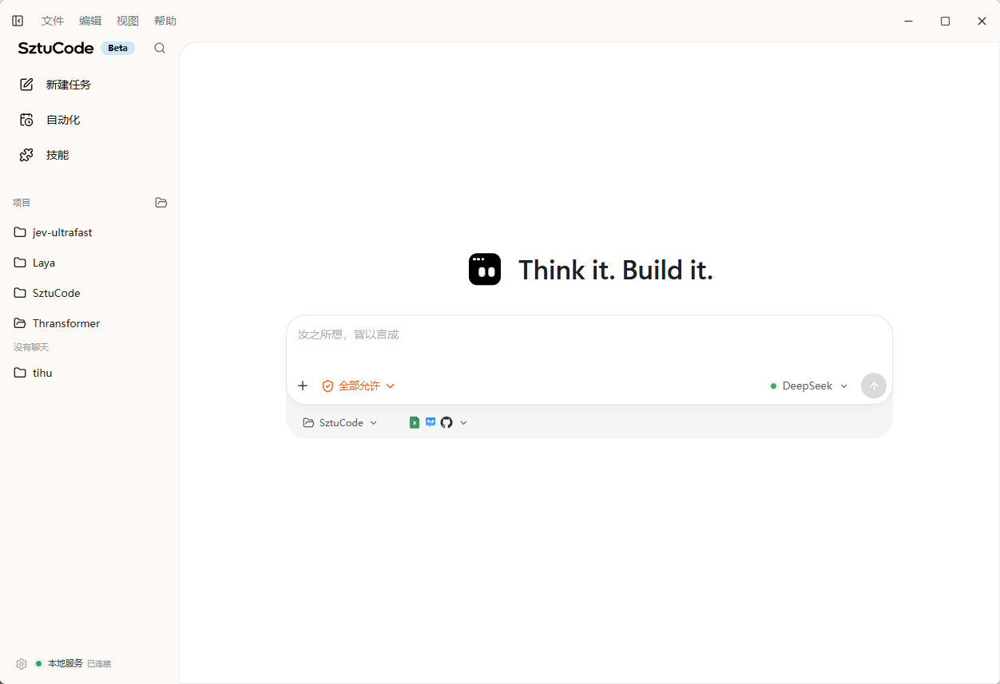
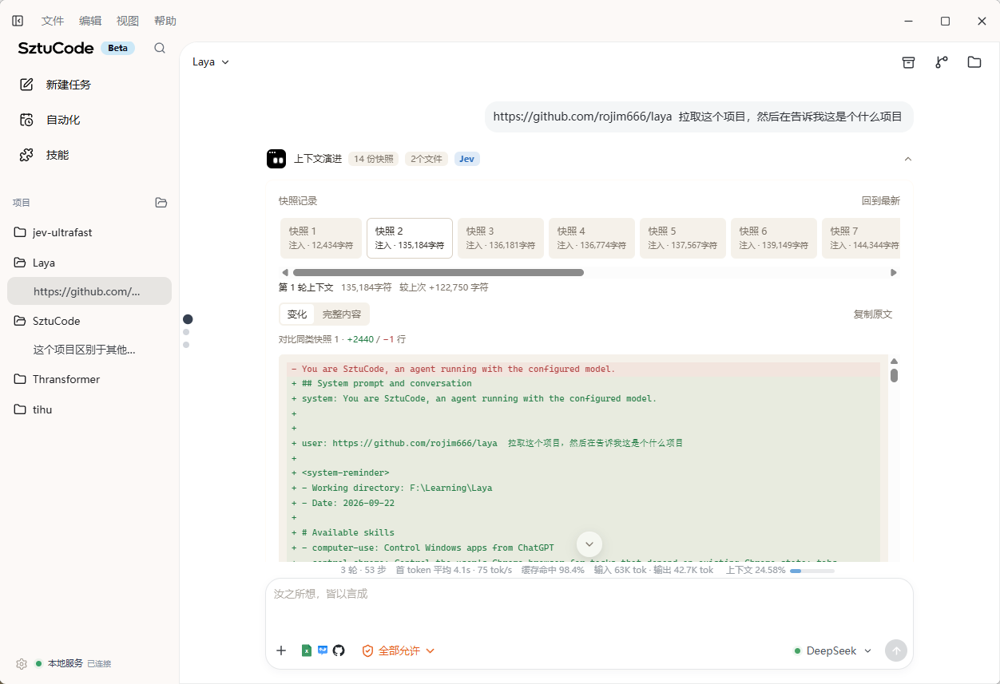

# SztuCode

> 一个本地优先、事件驱动、可审计的 AI Coding Agent 运行时（TypeScript 实现）。

[](https://www.typescriptlang.org/)
[](https://tauri.app/)
[](https://vuejs.org/)
[](LICENSE)

## 项目界面

### 桌面工作台





SztuCode 面向真实代码仓库工作。后台 daemon 负责运行 Agent Loop、调用工具、管理权限和保存会话，并通过 JSON-RPC 事件流持续反馈执行状态。

它既是一个持续完善的本地 AI 编程工具，也是一个用于学习 Agent 工程、软件协作与可信 AI Coding 的开放项目。

那有同学就要问了，为什么都有了codex和Claude code，甚至是其他agent产品如workbuddy，tare work等，我们还是要搭建一个自己的Agent呢，原因就是现阶段Agent岗层出不穷，梁圣自己也说了Agent harness很重要，所以希望有这么一个学习的平台，来让大家接触一些前沿的Agent知识，但贡献知名的coding agent项目还是太难了，opencode和herms agent这些，上手难，理解慢，也不好去根据issue去做相应的pr，所以我就想着做一个学校里大家最方便接触的开源项目，所以我们搞了这么一个项目，而且还尝试接入了一些内置模型，大家能直接通过项目使用免费的deepseek-v4-flash和mimo-v2.5，欢迎大家尝试并点个star。

并不是说要重复造轮子，做一个超越codex和claude code的产品，而是理解与学习，带着批判的目光去看清现有的agent真正的运作方式，知己知彼方能百战不殆。

> [!IMPORTANT]
> 项目目前处于 `0.x` 快速开发阶段，接口和界面仍可能变化。请在独立分支和可恢复的工作区中使用 Agent，并谨慎启用 `auto` 权限模式。

> [!NOTE]
> SztuCode 由社区成员发起和维护，不代表任何学校、学院或社团的官方立场。未经授权，项目不使用相关组织的官方名称、标识或背书。

## 为什么是 SztuCode

项目不止封装模型 API，而是尝试复现当前 AI Coding Agent 的完整工程链路：

```text
用户目标
  → 项目与会话上下文
  → Agent 规划和模型推理
  → 工具调用与权限审批
  → 文件修改、测试和结果回填
  → Diff 审阅、Trace 与会话恢复
```

当前项目适合：

- 学习 Agent Loop、工具调用、上下文治理和多智能体协作；
- 构建本地优先、可观察、可扩展的 Coding Agent；
- 研究项目级代码理解、权限安全、RAG 与执行轨迹评测；
- 通过 Issue、Pull Request、Review 和 Release 参与真实开源协作。

## 运行时架构

本分支是 TypeScript 主线：daemon、CLI、协议契约和评测 runner 全部位于 `packages/`，桌面端连接同一 daemon。历史上的 Python 双实现保留在仓库 `main` 分支及 `python-runtime` 相关分支中，作为契约对齐的参考实现，不在本分支出现。

| 维度 | 说明 |
| --- | --- |
| 代码位置 | `packages/`（protocol / runtime-ts / cli / evaluation） |
| daemon 入口 | `packages/runtime-ts/src/main.ts` |
| 默认端口 | `127.0.0.1:7438` |
| CLI 命令 | `sztu-ts`（发布包名 `sztucode` / `sztucode-tui`） |
| 图形界面 | Tauri 2 + Vue 3 桌面工作台 |
| 依赖管理 | npm workspaces |
| 契约方式 | TS 类型包 + 生成 `wire-protocol.md` |
| 传输 | TCP / NDJSON / JSON-RPC 2.0 |
| 持久化 | `~/.sztu/` |
| 质量工具 | tsc、tsx --test、e2e 脚本 |
| 版本 | 0.2.0 |

客户端通过同一套 JSON-RPC 协议连接 daemon，Agent 执行状态以 daemon 为准。

## 核心能力

| 能力 | 当前实现 |
| --- | --- |
| Agent Runtime | 基于 ReAct 的多步推理、工具调用、结果回填和终止控制 |
| 多种客户端 | Tauri 2 + Vue 3 桌面工作台、Node 终端 chat（TS） |
| 模型接入 | Anthropic 与 OpenAI-compatible 双协议，可连接兼容服务商；内置免费模型 profile（如 deepseek-v4-flash、mimo-v2.5） |
| 工作区工具 | 文件读取、目录浏览、搜索、写入、精确编辑和受控 Shell 执行 |
| 权限系统 | `normal`、`plan`、`accept_edits`、`auto` 四种运行模式，持久化策略与 denial 追踪 |
| 会话与记忆 | 持久化会话、分层上下文、Notes、历史恢复和上下文压缩（js-tiktoken，带 CJK 感知回退） |
| 扩展机制 | Skills、Subagents 与 MCP 外部工具统一接入 |
| 可观测性 | IPC、EventBus、LLM 三层 Trace，支持事件跟踪和回放 |
| 变更审阅 | 桌面端展示文件变化和 Diff，支持接受、暂存与回退 |
| 项目指令 | 自动发现并注入工作区及父目录的 `CLAUDE.md`、`SZTUCODE.md` 等规则 |
| 多 Agent 工作流 | Planner → Coder / Tester / Reviewer 结构化 DAG 编排，范围升级留 Trace 证据 |
| Agent 评测 | `packages/evaluation`，统一任务协议与 SWE-bench 适配 |

项目级语义索引、统一 LSP、领域 RAG、安全扫描闭环和完整多智能体工作流仍在路线图中，不将设计目标描述为已完成能力。

## 系统架构

SztuCode 使用 daemon 与客户端分离的架构。长任务不依赖某个界面窗口的生命周期，不同客户端共享一致的会话、权限和执行状态。

```text
Tauri Desktop ─┐
Node CLI ──────┼─ TCP / NDJSON / JSON-RPC 2.0 ─ TypeScript daemon (7438)
Eval Runner ───┘                                  │
                                                  ├─ Workspace / Session
                                                  ├─ Agent Runner / Loop
                                                  ├─ LLM Provider
                                                  ├─ Tools / Permissions
                                                  ├─ Skills / Subagents / MCP
                                                  ├─ Memory / Compaction
                                                  └─ EventBus / Trace
```

TypeScript runtime 默认监听 `127.0.0.1:7438`。IPC 命令和事件详情见[架构说明](docs/reference/architecture.md)。

## 快速开始

### 环境要求

- Git；
- Node.js 20+；
- Anthropic 或 OpenAI-compatible API 凭据；
- 可选：Rust 和 Tauri 平台依赖，用于桌面端开发。专业 artifact Skill 可能按需调用系统 Python，但不属于项目运行时依赖。

### 安装

```bash
git clone https://github.com/rojim666/SztuCode.git
cd SztuCode
npm install
npm run build
```

复制配置模板：

```bash
cp .env.example .env
```

Windows PowerShell：

```powershell
Copy-Item .env.example .env
```

在 `.env` 中选择 Provider，并填写服务商实际提供的模型 ID 和凭据：

```dotenv
# Anthropic
SZTU_LLM_PROVIDER=anthropic
SZTU_LLM_DEFAULT_MODEL=<your-provider-model-id>
ANTHROPIC_API_KEY=<your-api-key>

# 或 OpenAI-compatible
# SZTU_LLM_PROVIDER=openai
# SZTU_LLM_DEFAULT_MODEL=<your-provider-model-id>
# OPENAI_API_KEY=<your-api-key>
# OPENAI_BASE_URL=https://api.example.com
```

使用免密 OpenAI-compatible 端点时还需设置 `SZTU_LLM_KEYLESS=true`，或直接在桌面模型管理页选择内置免费 profile。

不要提交 `.env`。完整字段和优先级见[配置参考](docs/getting-started/configuration.md)。

### 启动 daemon

```bash
npm run daemon             # 启动 TS daemon（7438）
```

另一个终端中：

```bash
npm run cli -- ping                        # 连通性检查
npm run cli -- run --goal "分析当前项目并修复测试失败"
npm run cli -- chat                        # 交互式会话
npm run cli -- trace                       # 查看运行时事件 trace
npm run cli -- core status                 # daemon 状态
```

发布安装后使用 `sztu-ts`（`sztucode` 仍是兼容别名）：

```bash
npm install --global sztucode-tui
sztu-ts [项目路径]
```

### CLI 命令

| 命令 | 说明 |
| --- | --- |
| `ping` | 连通性检查 |
| `run --goal <task>` | 执行任务 |
| `chat [project]` | 交互会话 |
| `core start / status / stop` | daemon 管理 |
| `trace [run_id] [--raw] [-f]` | 事件 trace |
| `--version` | 版本 |

更完整的安装说明见[安装与启动](docs/getting-started/installation.md)。

## 桌面工作台

`desktop/` 是基于 Tauri 2、Vue 3 和 TypeScript 的图形客户端（仅连接 TypeScript daemon），提供项目与会话管理、执行时间线、权限审批、文件浏览、代码预览和 Git 变更审阅。

```bash
# 终端 1：仓库根目录
npm run daemon

# 终端 2
cd desktop
npm install
npm run tauri dev
```

桌面端验证：

```bash
cd desktop
npm run build
npm run test:visual

cd src-tauri
cargo check
```

平台依赖和已知限制见 [Desktop README](desktop/README.md) 与[开发环境](docs/development/development.md)。

## 项目结构

```text
SztuCode/
├─ packages/                 # TypeScript 链（npm workspaces）
│  ├─ protocol/              #   JSON-RPC、事件和工作流契约（类型包）
│  ├─ runtime-ts/            #   daemon、Agent Loop、工具、权限与扩展系统
│  ├─ cli/                   #   Node 命令行客户端
│  └─ evaluation/            #   评测 runner 与报告
├─ desktop/                  # Tauri 2 + Vue 3 桌面工作台（连 TS daemon）
├─ scripts/                  # 协议生成、链接检查等工程脚本
├─ tmp/                      # 本地评测产物（不提交）
└─ docs/                     # 使用、开发、架构、运维、评测和历史文档
```

完整模块边界和运行链路见[架构说明](docs/reference/architecture.md)。

## 开发与验证

```bash
npm run typecheck
npm test
npm run build
npm run build --prefix desktop
```

协议契约位于 `packages/protocol`。测试范围、桌面验证和模块修改清单见[测试指南](docs/development/testing.md)与[开发环境](docs/development/development.md)。

## Agent 评测

离线运行 10 个内部 Coding Agent 基准并生成 JSON/Markdown 报告：

```bash
npm run eval -- run --manifest packages/evaluation/tasks/internal-v1.json --repeat 3 --output-dir tmp/eval
```

任务格式、真实 daemon runner、指标定义和 SWE-bench Lite 小样本流程见[评测指南](docs/guides/evaluation.md)。

## 路线图

项目按可验证能力逐步推进：

| 阶段              | 目标                                               |
| ----------------- | -------------------------------------------------- |
| Contributor Ready | 新成员能理解项目、运行检查并提交第一个聚焦 PR      |
| v0.1              | 稳定本地任务闭环、自动化评测基线和更可靠的权限边界 |
| v0.2              | 项目级语义索引、分层上下文、统一 LSP 和多语言评测  |
| v0.3              | 领域 RAG、安全扫描闭环和角色化多智能体协作         |
| v1.0              | 稳定升级路径、发行流程、安全响应和兼容性政策       |

详细版本门槛、研究轨道和明确非目标见[项目路线图](docs/ROADMAP.md)。当前研究与工程任务可在 [GitHub Issues](https://github.com/rojim666/SztuCode/issues) 查看。

## 参与贡献

欢迎同学、开发者和研究者通过代码、测试、文档、设计、评测和问题分析参与。新贡献者可以从 [`good first issue`](https://github.com/rojim666/SztuCode/labels/good%20first%20issue) 开始，需要社区协作的任务会标注 [`help wanted`](https://github.com/rojim666/SztuCode/labels/help%20wanted)。

开始前请阅读：

- [贡献指南](CONTRIBUTING.md)
- [社区行为准则](CODE_OF_CONDUCT.md)
- [安全政策](SECURITY.md)
- [文档中心](docs/README.md)

安全漏洞、权限绕过和凭据泄漏请使用 [Private Vulnerability Reporting](https://github.com/rojim666/SztuCode/security/advisories/new)，不要创建公开 Issue。

## Contributors

感谢所有参与代码、测试、文档和工程建设的贡献者。以下名单依据仓库可验证的 Git 历史整理，本地同邮箱别名已合并；完整记录以 [GitHub Contributors](https://github.com/rojim666/SztuCode/graphs/contributors) 为准。

<table>
  <tr>
    <td align="center">
      <a href="https://github.com/rojim666">
        <br />
        <sub><b>rojim666</b></sub>
      </a><br />
      <sub>发起人与维护者</sub>
    </td>
    <td align="center">
      <a href="https://github.com/charon2121">
        <br />
        <sub><b>charon2121</b></sub>
      </a><br />
      <sub>Contributor</sub>
    </td>
    <td align="center">
      <a href="https://github.com/szzhangkkk">
        <br />
        <sub><b>szzhangkkk</b></sub>
      </a><br />
      <sub>Contributor</sub>
    </td>
  </tr>
  <tr>
    <td align="center">
      <a href="https://github.com/GuanG-1008">
        <br />
        <sub><b>GuanG-1008</b></sub>
      </a><br />
      <sub>Contributor</sub>
    </td>
    <td align="center">
      <a href="https://github.com/neutronstar238">
        <br />
        <sub><b>neutronstar238</b></sub>
      </a><br />
      <sub>Contributor</sub>
    </td>
    <td align="center">
      <a href="https://github.com/Shuang-su">
        <br />
        <sub><b>Shuang-su</b></sub>
      </a><br />
      <sub>Contributor</sub>
    </td>
  </tr>
  <tr>
    <td align="center">
      <a href="https://github.com/crazy19-69">
        <br />
        <sub><b>crazy19-69</b></sub>
      </a><br />
      <sub>Contributor</sub>
    </td>
    <td align="center">
      <a href="https://github.com/electrojay27">
        <br />
        <sub><b>electrojay27</b></sub>
      </a><br />
      <sub>Contributor</sub>
    </td>
  </tr>
</table>

贡献以公开 Issue、Commit、Pull Request、Review 和 Release 为准；持续贡献者可以逐步承担模块 Review 和维护职责。

## License

SztuCode 使用 [MIT License](LICENSE)。
