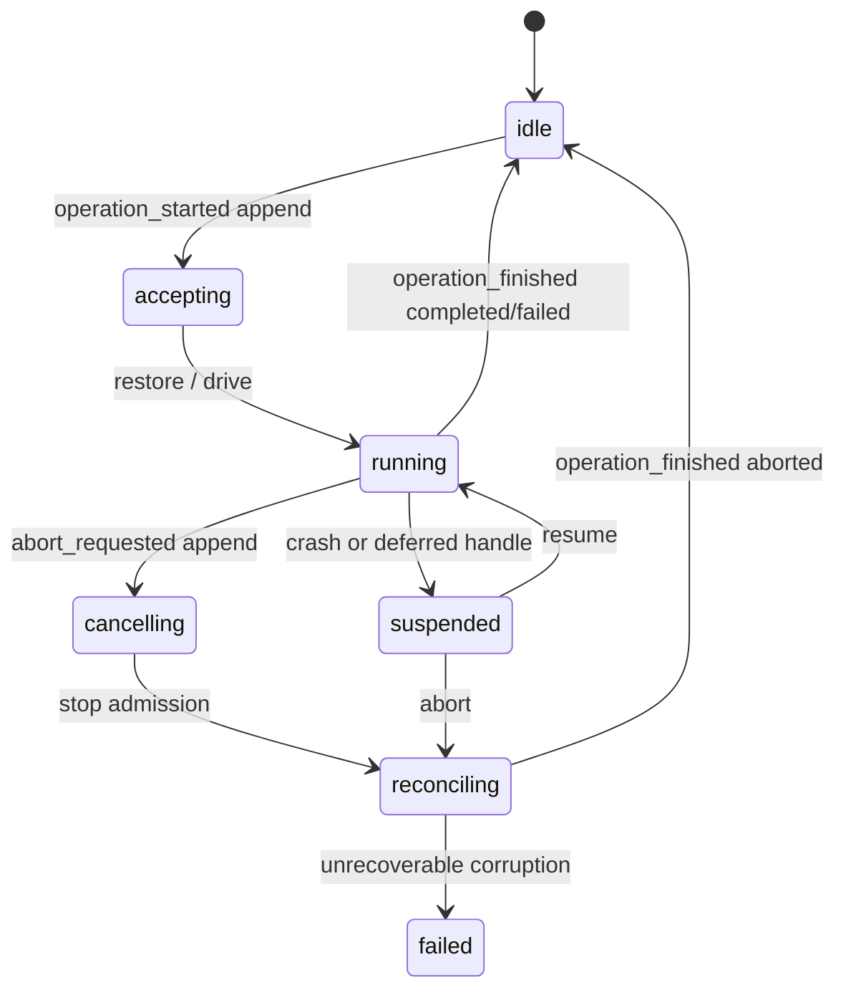
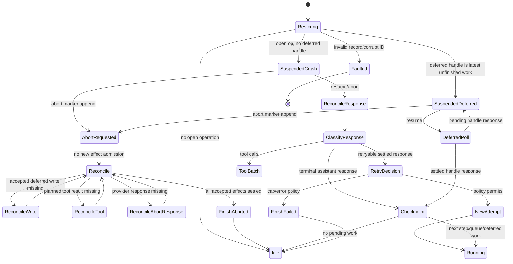

# Durable Harness 设计

> 本文是设计稿，不是 Durable Harness 的实现计划之外的生产代码变更。它参考 pi 的 `packages/agent/src/harness` 与 `docs/harness-v2.md` 的持久化边界和恢复语义，结合 SztuCode 当前的 `SessionRuntime`、`AgentSession`、`AgentLoop`、JSONL session backend、workflow 和 TCP/NDJSON daemon 约束重新定义接口。

## 1. 目标与边界

Durable Harness 的目标是：一次已经接受的 prompt 即使跨越进程崩溃，也只能观察到“尚未发生”或“恢复后完整完成/明确失败”的结果。Harness 负责 durable orchestration；`SessionRuntime` 负责一次具体的模型、工具和权限执行。Harness 不直接拥有 socket，不直接改变现有 JSON-RPC/NDJSON 协议，也不替换当前 7438 daemon。

本设计第一阶段只定义记录、恢复和测试契约：

- 生产代码继续使用当前 `AgentSession`/`SessionRuntime`，暂不把 `RunManager` 一次性删除；
- 现有 JSONL session、`thread.jsonl`、`context.json` 和 run event 文件保持可读；
- 一个 session 由一个 writer/harness 负责，多个 client 连接通过 daemon 路由到同一个 harness；
- 事件是观察通道，不能改变执行；hook/扩展是执行边界，可能改变输入，但其结果必须先进入 durable record 才能影响恢复；
- provider stream 不做中途续流。没有完整响应的 provider attempt 视为 unknown external effect；
- 没有 exactly-once 的任意外部副作用承诺。需要 crash-safe 的工具必须提供幂等键、读回校验或明确声明不可重放。

### 1.1 术语

| 术语 | 定义 |
| --- | --- |
| Session | 共享的 append-only 对话树、lane、操作日志和全局事实的持久化容器 |
| Branch | 对话树中从某个已有 entry 分叉出的路径；不复制历史 |
| Lane | 一个命名的 branch position 和其串行工作队列；每个 lane 同时至多一个 operation |
| Operation | 一次 durable 工作，例如 prompt run、compaction 或 navigation |
| Step | operation 内可恢复的稳定逻辑单元，例如 assistant generation、deferred fetch 或 tool batch |
| Attempt | 一个 step 的具体 provider/tool 外部执行编号，从 1 开始递增 |
| Intent | 外部效果执行前的 durable 意图，包含稳定的 provisioned result ID |
| Reconciliation | abort 或 crash recovery 对已接受但未结算记录的补全过程 |
| Deferred work | 已接受、必须最终应用但允许延迟到 checkpoint 的写入或队列工作 |

## 2. 核心不变量

1. 所有 durable record 只追加，不修改、不删除；恢复通过按 sequence 归约得到状态。
2. tree entry、lane record、global fact 使用同一 session sequence，读取时按序处理。
3. 一个 lane 至多存在一个未结束 operation；多个 lane 可以并行，但仍由同一个 session writer 串行提交。
4. `operation_started` 先于所有 operation 内记录，且只能有一个对应的 `operation_finished`。
5. `step_started` 为 step 分配稳定 `step_id`，每个 attempt 分配稳定 `attempt_id` 和所需的 result ID；恢复不得重新生成这些 ID。
6. 任何 provider/tool/hook/timer 之前都经过可注入的 action boundary。测试可以在 boundary 停机、关闭并重新打开。
7. 外部调用完成后，必须先 durable settle（response/result/usage），再进行分类、重试、压缩、继续或结束。
8. abort marker 的优先级高于后续自动继续；marker 之前已提交的结构性结果必须保留，marker 之后不得新开 provider/tool effect。
9. 业务结果不依赖 telemetry；telemetry 失败只产生诊断，不改变 operation 状态。
10. session tree 只保存对话内容和结构性摘要；lane configuration、tool intent、retry state、recovery state 不进入模型上下文。

## 3. Durable 数据模型

### 3.1 必须持久化的状态

| 类别 | 必须字段 | 原因 |
| --- | --- | --- |
| Session identity | `session_id`、format/schema version、created/updated | 选择正确恢复器并拒绝未知格式 |
| Tree | entry ID、`parent_id`、kind、完整 payload、sequence | 重建 branch 和 provider context，不复制历史 |
| Lane | lane name、leaf ID、创建 anchor、完整 lane config | 恢复每个 lane 的上下文和配置；lane 间互不覆盖 |
| Operation | `operation_id`、kind、lane、accepted intent、status、started sequence | 确认 prompt 是否已接受，判断是否有未结束工作 |
| Operation terminal | `operation_finished` outcome、error/reason、finished sequence | 恢复必须有唯一终点，避免重复结束 |
| Step | `step_id`、kind、trigger entry、captured config、normalized retry policy | 重启后不依赖内存 program counter |
| Attempt | `attempt_id`、step ID、number、effect kind、provisioned result IDs、started sequence | 识别未知 provider/tool effect，继续编号而不复用结果 ID |
| Assistant response | response entry ID、stop reason、complete response、usage | stream 不能部分恢复；分类前先保存完整响应 |
| Tool call | source index、provider `tool_call_id`、tool name、effective args、replay policy、result entry ID | 保持工具源顺序、参数和重放决策 |
| Tool result | result entry ID、status/output/error、usage、terminate、effect state | crash 后不重复成功调用，缺失结果可合成中断结果 |
| Abort | 单一 `abort_requested` marker、请求时间、reason、drain policy | abort 是权威意图；重复 abort 不重复写 marker |
| Deferred work | work ID、完整 payload、target lane/branch、accepted sequence、applied entry ID | abort 后仍要应用已接受的 tree write |
| Provider retry | retry policy snapshot、next attempt number、retry reason、retryable class | 重启后使用 step 原 policy，不受新配置影响 |
| Unknown external effect | effect kind、attempt ID、provisioned ID、known/unknown/settled | 区分“未调用”与“已调用但结果丢失” |
| Recovery audit | recovery generation、action kind、reconciled IDs、diagnostic | 可解释恢复、检测重复修复和 corruption |

以下状态可以只在内存中保存并从上述记录重建：当前 executor、AbortController、provider client、工具实现、socket connection、partial token buffer、telemetry span object。partial stream 永不作为可恢复状态写入。

### 3.2 Record envelope

所有记录使用统一 envelope；字段名是设计契约，不要求第一版立刻改变现有 JSONL：

```ts
type DurableRecord = {
  schema: 1;
  sequence: number;
  ts: string;
  session_id: string;
  lane: string;
  operation_id?: string;
  type: string;
  payload: Record<string, unknown>;
};
```

同一 operation 的记录使用 `operation_id`，配置和 next-run queue 可以没有该字段。所有 provisioned IDs 必须在同一个 session 内唯一。恢复发现相同 ID 但内容不同，视为 corruption，不得“选择最后一个”。

## 4. Operation 生命周期

### 4.1 `operation_started`

`operation_started` 是 prompt、compaction、navigation 的 acceptance point。写入完整 intent，而不是只写一个用户文本：

```json
{
  "type": "operation_started",
  "payload": {
    "operation_id": "op-01",
    "kind": "run",
    "lane": "main",
    "intent": {
      "messages": [{ "role": "user", "content": "..." }],
      "trigger_message_id": "msg-01"
    },
    "config_seed": {
      "model_ref": { "provider": "configured", "model_id": "model-a" },
      "thinking_level": "medium",
      "active_tool_names": ["read_file"]
    }
  }
}
```

写入成功后，API 才能返回 accepted/run ID。若写入失败，业务不应开始 provider/tool effect。`messages` 可以包含图片引用，但不得把 API key、provider headers 或 secret 写入 intent；敏感内容是否进入 session tree 由现有 session policy 决定。

### 4.2 `operation_finished`

operation 只允许一个 terminal record：

```ts
type OperationOutcome = "completed" | "failed" | "aborted" | "declined";
```

`failed` 必须带稳定 error class/message；其他 outcome 不得伪装成业务 failure。`aborted` 只有在更早的 `abort_requested` 存在时合法。重复 finish 读取并返回已有 terminal result，不追加第二条记录。

### 4.3 Operation 状态



`reconciling` 不是允许 provider/tool 执行的状态；它只能完成已接受的写入、已有效果的结算、合成结果和 terminal marker。

## 5. Step 与 assistant response intent

### 5.1 Step records

每个 step 写入：

```ts
type StepStarted = {
  type: "step_started";
  step_id: string;
  kind: "assistant_generation" | "deferred_fetch" | "compaction" | "branch_summary" | "tool_batch";
  trigger_entry_id?: string;
  captured_config?: LaneConfig;
  retry_policy?: RetryPolicy;
  source_response_id?: string;
};

type StepFinished = {
  type: "step_finished";
  step_id: string;
  status: "succeeded" | "failed" | "aborted" | "deferred";
  result_id?: string;
  error?: DurableError;
};
```

`step_started` 的 config 和 retry policy 是 immutable snapshot。即使用户在 step 中途修改 model/thinking/tools，当前 step 的所有 retry 使用原 snapshot；下一 step 才使用新配置。

### 5.2 Assistant response intent

provider request 之前追加 `assistant_response_intent`：

```ts
type AssistantResponseIntent = {
  type: "assistant_response_intent";
  step_id: string;
  attempt_id: string;
  attempt: number;
  response_entry_id: string;
  trigger_message_id: string;
  context_fingerprint: string;
  provider_ref: { provider: string; model_id: string };
  retry_policy: RetryPolicy;
};
```

它不包含完整 prompt 或 API key，只保存 provider/model identity 和 context fingerprint。完整 response 在 provider settle 后一次性 append 到 `response_entry_id` 下；`error`、`aborted`、`deferred` response 也要完整落盘后再分类。partial token 永不落盘。

### 5.3 Response 分类顺序

1. provider 返回或抛出结果；
2. 将 complete response/usage append 到 provisioned ID；
3. 根据 stop reason/error class 分类；
4. 如可恢复 overflow 且该 `trigger_message_id` 尚未 compact，创建 compaction step；
5. 如有 tool calls，创建 tool batch intent；
6. 否则 checkpoint 后结束或消费 queued/deferred work；
7. 最后写 `step_finished`，必要时写 `operation_finished`。

这样 crash 位于 response 和分类之间时，恢复只需读取已经存在的 response，不会再次生成同一 assistant response。

## 6. Tool call intent/result

### 6.1 Tool batch 与 call intent

assistant response 中的每个 tool call 必须先建立一个稳定 source index 和 result ID，再进行 lookup、schema validation、before-tool hook 和 permission：

```ts
type ToolCallIntent = {
  type: "tool_call_intent";
  step_id: string;
  batch_id: string;
  source_index: number;
  tool_call_id: string;
  tool_name: string;
  requested_args: JsonValue;
  effective_args?: JsonValue;
  result_entry_id: string;
  replay: "never" | "safe";
  permission_class?: string;
};
```

`requested_args` 和 `effective_args` 是否保存完整内容按数据策略决定；默认只保存 hash、参数 schema version 和安全 preview。涉及文件内容、API key 或 prompt 的参数不得默认进入 trace/telemetry；durable session record 若业务需要保存，必须显式 opt-in。

### 6.2 `tool_call_result`

真实工具 effect 之前写 `tool_started`（或 `tool_call_result` 的 `started` 状态），结束后按 assistant source order append：

```ts
type ToolCallResult = {
  type: "tool_call_result";
  result_entry_id: string;
  batch_id: string;
  source_index: number;
  status: "succeeded" | "failed" | "blocked" | "invalid" | "aborted" | "interrupted" | "unknown";
  output_ref?: string;
  error?: DurableError;
  usage?: ToolUsage;
  terminate?: boolean;
  effect: "not_started" | "settled" | "unknown";
};
```

lookup/validation/permission 阻止的 call 不写 `tool_started`，但必须写 result；否则恢复会把它误认为未处理。并行工具可以同时执行，结果仍按 `source_index` 追加，避免 provider context 顺序不稳定。

### 6.3 文件写入的去重规则

对 `write_file`、`edit_file` 等可改变文件的工具，第一阶段要求：

1. intent 生成 `effect_id`、target path、expected base hash、new content hash、result ID；
2. 工具使用同目录临时文件、fsync（可用时）和 atomic rename；
3. 写入前若 target 已等于 `new content hash`，视为本 effect 已完成，禁止再次写入；
4. target 与 expected base hash 不一致时返回 conflict，不覆盖未知修改；
5. crash 位于 rename 后和 result append 前时，恢复通过 hash/operation effect ledger 判定为 settled，只补 result，不重复 rename；
6. crash 无法判断目标状态时，结果为 `unknown`，不得自动重试写文件；只能人工确认、读取校验后 reconcile，或由工具声明可安全重放；
7. 不使用“同一 prompt 文本相同”作为去重键，必须使用 `effect_id`/content hash/expected base hash。

Shell、网络请求、发送消息、提交 Git 等外部效果默认 `replay: "never"`。即使 provider retry policy 允许重试，也不能覆盖工具 replay policy。

## 7. Abort reconciliation

`abort()` 不是立即把内存状态改成 finished，而是两阶段操作：

1. 在 lane mutation line append 一条 `abort_requested`；第一个成功 append 的 marker 获胜；
2. 停止 admission，向当前 provider/tool/permission signal 发送 abort；
3. 返回 accepted/cancelling，重复调用返回相同 operation ID 和 drain 结果，不重复写 marker；
4. 进入 reconciliation，只处理 marker 之前已经 accepted 的 work。

Reconciliation 顺序固定：

1. 补齐 `operation_started` 后已接受但缺失的初始 user/deferred tree entries；
2. 对当前 assistant/deferred provider attempt：有完整 response 则先写 usage/分类；没有 response 则在 provisioned response ID 下写 synthetic `aborted`，不再次访问 provider；
3. 对 tool batch：已写 `tool_started` 的 effect 若有可验证 settled 状态则补结果；否则写 `unknown`/`interrupted` synthetic result，绝不自动重放 `replay: never`；未开始的 planned calls 写 `aborted` 或 `blocked` result；
4. 应用已接受的 deferred writes；steer/follow-up queue 按策略退回或标记 cancelled，`nextRun` 保留；
5. 对已提交的 compaction/branch structural result 做 presence check，已提交的不回滚；
6. append 唯一的 `operation_finished { outcome: "aborted" }`。

abort 不会为了产生漂亮 transcript 而发送新的 LLM 请求，也不会追加虚假的 assistant message。`operation_finished` 是客户端观察到 operation 结束的唯一权威记录。

## 8. Daemon crash recovery

### 8.1 启动流程

恢复必须在 daemon 开始接受 provider/tool effect 之前完成：

1. 打开 session backend，校验 schema、sequence 单调性、ID 唯一性和 branch parent；
2. 归约 tree、global facts、lane config 和 lane records；
3. 每个 lane 找到最新 `operation_started` 与 terminal record；
4. 没有 terminal 的 open operation 标记为 `suspended(reason: "crash")`，不得假设内存 program counter；
5. 批量读取 provisioned response/result IDs 和 deferred work presence；
6. 生成 `RecoveryPlan`，只描述下一项 unfinished transition；恢复本身默认不写记录；
7. `resume()` 进入 ordinary procedure 的第一个 unfinished boundary：settle missing response、repair usage、reconcile tool batch、poll one deferred work 或 checkpoint；
8. 只有 `drive: automatic` 才自动执行 plan；manual drive 暂停并暴露 action；
9. 任何校验失败都把 session 标记 faulted，停止所有 effect，返回诊断，而不是猜测修复。

### 8.2 不使用持久化 program counter

恢复状态由记录归约得到，而不是持久化“下一行代码”：

```text
operation_started
  -> latest step_started
  -> attempts and provisioned IDs
  -> response/result presence
  -> abort marker / deferred lineage
  -> first missing durable transition
```

恢复 action 每完成一个 append 就重新读取/更新内存 reduction；如果进程再次崩溃，下一次恢复从更长的 prefix 开始并跳过已经存在且内容一致的 ID。存在不同 payload 的同 ID 是 corruption。

### 8.3 响应与工具的 crash 窗口

| 崩溃点 | 恢复动作 |
| --- | --- |
| `operation_started` append 前 | operation 未接受；不启动任何 effect |
| `operation_started` 后、初始 message 缺失 | 用原 intent 补一次 entry |
| provider intent 后、request 前 | 没有 external effect；按 retry policy 可启动下一 attempt |
| provider request 后、response 缺失 | unknown provider effect；不复用 response ID，按 policy 启动下一 attempt 或 synthetic interrupted |
| response 完整 append 后、分类前 | 读取 response/usage，继续分类，不重发 provider |
| `tool_started` 后、result 缺失 | 根据工具 replay policy：安全且可证明未完成可重放；否则 unknown/interrupted |
| 文件 rename 后、tool result 缺失 | hash/ledger 已匹配则只补 result；无法证明则 unknown，不重写 |
| deferred handle 持久化后 | operation suspended；resume 只 poll 已有 handle |
| `abort_requested` 后 | 只执行 reconciliation，不新开 provider/tool |
| `operation_finished` append 前 | 重建并补唯一 terminal record |

## 9. Deferred work

Deferred work 用于“必须最终应用但当前 step 不应插入 provider context”的动作，例如运行中写入 session tree、summary、用户 deferred message 或外部队列。

```ts
type DeferredWork = {
  type: "deferred_work";
  work_id: string;
  lane: string;
  target: "tree_entry" | "session_fact" | "queue";
  payload_hash: string;
  payload_ref: string;
  survives_abort: boolean;
  applied_entry_id?: string;
};
```

acceptance 只写一次完整 payload/ref；checkpoint 应用时先检查 `work_id`/`payload_hash` 是否已有 applied entry，再 append。abort 不删除 `survives_abort` work。steer/follow-up 是 conversational queue，不是 deferred tree write：它们在 abort 时退回调用方，`nextRun` 则保留。

## 10. Lane 与 session branch

### 10.1 Lane

每个 session 必须有 `main` lane。lane name 是稳定外部 key，例如 `main`、`slack:<thread>`、`subagent:<id>`。lane 拥有：

- leaf entry ID；
- operation log 和 busy lock；
- steer/follow-up/nextRun queues；
- 完整替换式 lane config；
- lane-specific events/snapshot。

创建 lane 时原子写入 lane pointer 和 immutable seed config，不复制 tree、operation history 或另一个 lane 的当前 config。两个 lane 可从同一 leaf 分叉；append 后 tree parent 都指向各自当时的 leaf。

lane config setter 即使 operation running 也在 mutation line 立即追加完整 replacement。已开始 step 使用 captured config，下一 step 使用新 config。一个 lane busy 不阻塞其他 lane；同一 lane 的第二个 operation 请求返回 busy/conflict，不排队隐式执行。

### 10.2 Session branch/navigation

branch 只改变 lane leaf，不复制 entry。navigation operation 的 durable intent 包含 target entry ID 和可选 branch summary policy：

1. append `operation_started(kind: "navigation")`；
2. 若需要 summary，先创建稳定 branch-summary step；provider/hook 完成后先 durable `branch_summary_prepared`；
3. 在一个 atomic storage append 中写 summary entry（如有）和 lane leaf move；
4. append `operation_finished(completed)`。

crash 在 move 前恢复 summary/operation；crash 在 atomic move 后只补 finish。已 move 的 lane 不回滚。branch summary 不是普通 assistant response，不进入 tool batch。

## 11. Provider retry

Retry policy 在 `step_started` 捕获并标准化：

```ts
type RetryPolicy = {
  max_attempts: number;
  backoff_ms: number[];
  retryable: Array<"rate_limited" | "transient" | "timeout" | "context_overflow">;
  unknown_effect: "retry_next_attempt" | "stop_at_cap" | "manual";
};
```

允许重试的情况：

- provider 在 request boundary 前明确失败；
- provider 返回明确 retryable error，且 response 已 durable settle；
- context overflow 只允许针对同一个 `trigger_message_id` 做一次 compaction，再创建下一 step；
- deferred fetch 的 poll 是已有 handle 的后续 numbered check，不是重新生成请求。

禁止或默认不自动重试：

- 已发出但没有完整 response 的 unknown provider effect，除非 policy 明确 `retry_next_attempt` 且 provider contract 允许重复；
- API key/auth/invalid request/schema 错误；
- `abort_requested` 之后的任何新 attempt；
- tool/external effect 的 retry policy 与 provider policy 冲突时，以 tool `replay: never` 为准。

每个 attempt 使用新的 `attempt_id`，不得复用已 provisioned response/result ID。retry 的 backoff timer 不是唯一状态来源；崩溃后根据 attempt records 和 policy 重新计算是否到达 retry boundary。

## 12. Unknown external effect

“unknown” 不是失败的同义词，而是 harness 无法证明 effect 是否发生：

```ts
type ExternalEffectState = "not_started" | "started" | "settled" | "unknown";
```

典型情况是 provider request/tool process/file rename 已离开进程，但 result append 尚未完成。恢复处理规则：

1. 先读取 effect-specific ledger、provisioned ID、filesystem fingerprint 或 provider handle；
2. 能证明 settled：只补 durable result/usage；
3. 能证明 not_started：按 policy 可启动新的 attempt，但必须新的 attempt ID；
4. 无法证明：写 `unknown`，operation 进入 `failed` 或 `suspended_manual`，等待用户/外部 reconciler；
5. 不通过“再执行一次并希望相同”消除 unknown。

所有 side-effecting tool 都必须在注册信息中声明 `replay: "safe" | "never"` 和可选 `reconcile(effectIntent): settled | not_started | unknown`。没有声明的工具按 `never` 处理。

## 13. 如何避免重复写文件

Durable ledger 只能防止 harness 自己重复 append，不能凭空让文件系统 exactly-once。因此文件工具必须同时满足：

- `effect_id` 与目标 path 在 intent 中确定；
- `expected_base_hash`、`new_content_hash` 和 encoding/line-ending policy 固定；
- 写入采用 temp file + fsync + atomic rename；
- result append 携带 `effect_id`，恢复先查 ledger，再查 target hash；
- target 已是 new hash 时视为已完成，不调用工具；
- target 是 expected base hash 时才允许第一次 apply；
- 两者都不匹配时返回 conflict/unknown，不覆盖用户或其他 lane 的修改；
- 任何“追加文本”操作必须使用 marker/idempotency key，不能用文件末尾字符串猜测是否写过；
- 同一 lane 的 deferred writes 按 work ID 串行应用；不同 lane 修改同一文件必须先经过 workspace conflict policy。

测试中必须模拟：rename 成功前崩溃、rename 成功后崩溃、ledger append 成功后崩溃、目标被第三方改写和重复 resume。

## 14. Recovery state machine

恢复状态机按 lane 独立运行，所有状态都能由 records 归约：



### 14.1 Recovery action priority

当多个 unfinished transitions 同时存在时，优先级固定为：

1. 校验 corruption/fault；
2. 已接受但缺失的 initial/deferred writes；
3. abort marker 下的 reconciliation；
4. 已 provisioned 且缺 response 的 provider attempt；
5. response usage repair；
6. missing tool results；
7. deferred fetch 单次 poll；
8. response classification/retry/compaction；
9. checkpoint（deferred writes、queue consume、next step）；
10. 唯一 `operation_finished`。

恢复 action 执行前再次检查 lane status、abort marker 和 provisioned ID presence，防止另一次恢复或 close race 造成重复 effect。

## 15. 事件与 snapshot

事件为 live observation，不作为恢复事实；恢复后的客户端先取 atomic snapshot，再订阅新事件。至少提供以下事件，字段应带 `session_id`、`lane` 和 `operation_id`：

### 15.1 Operation events

- `operation_started`：accepted intent 已持久化；
- `operation_finished`：唯一 terminal outcome；
- `abort_requested`：取消 marker 已持久化；
- `recovery_started` / `recovery_action` / `recovery_finished`：诊断和 action，不改变 ledger authority。

### 15.2 Step/assistant events

- `step_started`、`step_finished`；
- `assistant_response_intent`：仅报告 step/attempt/result ID 和非敏感摘要；
- `assistant_response_settled`：stop reason、usage、response ID，不默认发送完整 prompt/response；
- `provider_retry_scheduled`、`provider_effect_unknown`。

### 15.3 Tool events

- `tool_call_intent`：tool name、call ID、source index、result ID、replay policy；
- `tool_call_started`、`tool_call_result`；
- `tool_effect_unknown`、`tool_reconciled`。

### 15.4 Snapshot 最小内容

```ts
type LaneSnapshot = {
  lane: string;
  leaf_id: string | null;
  status: "idle" | "running" | "suspended" | "cancelling" | "faulted";
  operation?: { operation_id: string; kind: string; status: string };
  pending_deferred: string[];
  pending_queue_counts: { steer: number; follow_up: number; next_run: number };
  latest_recovery?: { state: string; action_id: string };
};
```

snapshot 不应包含 API key、完整 provider request、文件全文或未脱敏工具参数。需要查看 transcript 时使用 session tree/history 的既有权限和数据策略。

## 16. 恢复测试矩阵

测试必须同时覆盖 in-memory storage、JSONL backend，以及后续 SQLite backend 的相同 conformance suite。每个 case 都使用 manual drive，在列出的 boundary 强制 crash，重新打开 session，再执行 `resume()` 或 `abort()`；断言 durable records、tree、lane snapshot 和 external effect count。

| 类别 | Crash/输入点 | 恢复操作 | 关键断言 |
| --- | --- | --- | --- |
| Operation | `operation_started` 前/后 | resume | 前者无 operation；后者补 initial entry 且只一个 operation |
| Operation | response 已存在、finish 缺失 | resume | 补唯一 finish，不重复 assistant entry |
| Step | `step_started` 后 | resume | 使用同一 step ID/config/retry policy |
| Provider | intent 后 request 前 | resume | 允许的新 attempt 编号为 2；不复用 response ID |
| Provider | request 后 response 丢失 | resume/abort | retry policy 生效；abort 写 synthetic aborted，不发新 request |
| Provider | response 后分类前 | resume | 不重复请求；只完成分类/usage |
| Retry | 第一次 retryable failure 后 | resume | backoff 和 attempt count 从 durable policy 继续 |
| Overflow | 同 trigger 第一次/第二次 overflow | resume | 最多一次 compaction；第二次结束 failed |
| Deferred | handle persisted / pending poll response | resume | 只 poll 已有 handle；每次 poll 一个编号且 response 落盘 |
| Abort | abort marker append 前/后 | abort/resume | marker 至多一条；所有 accepted work reconcile；无新 provider/tool |
| Tool | lookup/validation/permission 前 | resume | 只写 blocked/invalid result，不写 tool_started |
| Tool | `tool_started` 后 result 前，replay safe | resume | 可证明未完成时至多一次安全 replay，结果 source order |
| Tool | `tool_started` 后 result 前，replay never | resume | unknown/interrupted，不重复外部调用 |
| File | rename 前/后崩溃 | resume | hash 已匹配只补 result；不重复写文件 |
| File | target 被第三方修改 | resume | conflict/unknown，不覆盖第三方内容 |
| Deferred write | acceptance 后 apply 前 | resume/abort | work ID 只应用一次；abort 后按 survives_abort |
| Lane | main 运行时另 lane prompt | resume | lane 独立恢复，sequence 可交错但每 lane 至多一个 open op |
| Branch | summary prepared / navigation move 前后 | resume | 已 move 不回滚；summary 不重复生成 |
| Crash loop | reconcile 每个 append 后再次 crash | repeated resume | 最终与一次完整恢复相同，append-only 无重复 ID |
| Corruption | duplicate ID、错误 parent、两个 open operation | reopen | session faulted，拒绝猜测修复 |
| Telemetry | adapter throw/flush fail | any | 业务结果不变，durable ledger 不缺关键记录 |
| Security | prompt/API key/path/file content 进入 intent/trace | any | 默认 trace/snapshot 不包含敏感值，显式 opt-in 才可保存 |

每个恢复测试都必须记录外部 effect counter 和 call arguments hash；仅断言最终文本不足以发现重复写文件或重复发送请求。

## 17. 分阶段落地建议

这不是本次实现范围，建议按以下兼容顺序推进：

1. 定义 record envelope、reducer、lane snapshot 和 in-memory manual drive；不改变现有 daemon。
2. 为现有 `SessionBackend` 增加 append-only operation records 的旁路文件/namespace，先支持 `operation_started/finished`。
3. 把 `AgentSession` 的 prompt/abort 接到 operation acceptance 和 reconciliation；`RunManager` 保持兼容 facade。
4. 加入 assistant response intent、usage settlement 和 provider retry recovery。
5. 加入 tool call intent/result、文件 effect ledger 和 replay policy。
6. 加入 deferred work、lane/branch/navigation 和 workflow/subagent lane 映射。
7. 最后把 server/client snapshot、resume、manual drive 和恢复测试矩阵接入桌面/CLI。

每一步都必须先补 conformance/recovery tests，再迁移一个能力。Durable Harness 不应通过一次性替换 `RuntimeServer` 或 `AgentLoop` 引入；任何未迁移的旧 run 都继续由兼容层运行，但不能伪装成已 durable。

## 18. 明确不承诺的事项

- 不承诺任意 HTTP、shell、Git remote 或模型请求的 exactly-once；只能记录 unknown 并要求 reconcile。
- 不持久化 partial token stream，也不尝试从 provider 恢复中断连接。
- 不允许多个进程同时写同一个 session；daemon serving layer 必须维持 writer lease/路由。
- 不把 telemetry、live event 或程序内存 queue 作为恢复事实。
- 不在本设计中改变 7438、TCP/NDJSON、JSON-RPC 或现有 session 文件格式。
