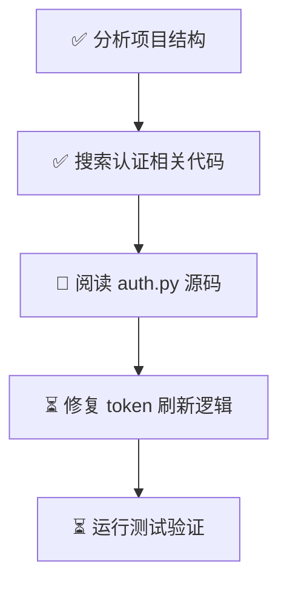

# SztuCode 记忆与压缩优化方案

> 历史方案记录：本文描述 2026-08-05 的 Python runtime 设计与当时的问题清单，不是当前
> TypeScript runtime 的状态说明。当前实现见 [记忆与压缩系统](memory-compression-system.md)。

> 参考蓝本：TencentDB Agent Memory（主）+ Hy-Memory 精选理念（辅）
> 适配框架：SztuCode `szzk_compression` 分支现有架构
> 日期：2026-08-05

---

## 一、现状诊断

### 1.1 当前压缩链路

```
工具执行 → ToolResult.content (字符串)
                │
                ├── budget.py: 截断 >8000 字符 → 丢弃 6000+ 字符
                │
                ▼
         context.messages 追加 tool_result block
                │
                ├── AgentLoop: context_pct >= 80% → 触发压缩
                │
                ▼
         compactor.py: LLM 生成 6 段摘要 → 全量替换消息历史
                │
                ▼
         store.write_compacted(): 备份 thread.jsonl → 写入 2 条压缩消息
```

### 1.2 核心问题

| # | 问题 | 严重度 | 影响 |
|---|------|:---:|------|
| P1 | **工具结果永久截断**：`budget.py` 截断后原始数据不可恢复 | 🔴 高 | Agent 看不到被截断的关键信息 |
| P2 | **压缩不可逆**：压缩后消息历史只有 2 条，中间推理全丢失 | 🔴 高 | 压缩失败 = 上下文永久损坏 |
| P3 | **压缩阻塞对话**：`compactor.compact()` 在 AgentLoop 热路径同步执行 | 🟡 中 | Agent 等压缩 LLM 返回才能继续 |
| P4 | **无结构化任务追踪**：消息历史是线性时间线，复杂任务中 Agent 容易迷路 | 🟡 中 | 多分支任务效率低 |
| P5 | **notes.md 无版本化**：`note_save` 纯追加，新旧矛盾信息共存 | 🟢 低 | Agent 可能读到冲突信息 |
| P6 | **Token 估算粗糙**：`len(text) // 4` 而非真实 tokenizer | 🟢 低 | 压缩触发时机不够精确 |

---

## 二、优化目标

| 目标 | 指标 | 当前值 | 目标值 |
|------|------|:---:|:---:|
| 工具结果零丢失 | 可回读完整输出比例 | 0%（截断即永久丢失） | 100%（全部可回读） |
| 上下文 Token 节省 | 高输出场景 token 消耗 | baseline | -30% ~ -50% |
| 压缩不阻塞 | 压缩耗时对 Agent 可见延迟 | 同步等待（LLM 调用 ×1） | 0（异步） |
| 任务导航清晰度 | 多分支任务完成率 | 未测量 | 相对提升 10%+ |

---

## 三、方案总览

分三个 Phase 渐进实施，每个 Phase 独立可交付、独立可测：

```
Phase 1: 上下文卸载                 Phase 2: 任务画布              Phase 3: 异步+版本化
（TencentDB 核心）                  （TencentDB 核心）              （Hy-Memory 精选）

工具输出 → refs/*.md               任务步骤 → *.mmd               压缩 → 后台异步
上下文仅保留摘要+路径               画布注入 system prompt           notes → supersedes 链
Agent 可按需回读                                                   Token → tiktoken 精确

  ↓                                   ↓                              ↓
  └── 数据基础 ──────────────────→ 画布节点引用卸载索引 ←── 两者可组合
```

---

## 四、Phase 1：上下文卸载（Context Offloading）

### 4.1 核心思路

> **不截断、不丢弃。工具输出写入外存文件，上下文只保留摘要 + 文件路径 + 新工具 `read_ref` 按需回读。**

### 4.2 数据模型

#### 卸载记录（`offload.jsonl`）

每次工具调用产生一条 NDJSON 记录：

```json
{
  "id": "off_20260805_001",
  "run_id": "20260805-143022-a1b2c3",
  "tool_name": "bash",
  "tool_use_id": "toolu_xxx",
  "ref_path": "refs/bash_20260805_001.md",
  "summary": "pytest 运行结果: 42 passed, 3 failed (test_auth.py, test_db.py, test_cache.py)",
  "char_count": 28431,
  "line_count": 512,
  "is_error": false,
  "ts": "2026-08-05T14:30:25Z"
}
```

#### 外部引用文件（`refs/<tool>_<ts>_<seq>.md`）

```markdown
# bash @ 2026-08-05 14:30:25
# Command: pytest tests/ -v
# Exit code: 0

============================= test session starts =============================
platform linux -- Python 3.12.0, pytest-8.0.0
collected 45 items

tests/unit/test_auth.py::test_login PASSED                              [  2%]
tests/unit/test_auth.py::test_logout PASSED                             [  4%]
tests/unit/test_auth.py::test_token_expiry FAILED                       [  6%]
...
========================= 42 passed, 3 failed in 2.34s ========================
```

### 4.3 目录结构变更

```
session_dir/
├── meta.json
├── thread.jsonl
├── notes.md
├── summary_*.md                  # 保持不变
├── thread_*.jsonl.bak
├── offload/
│   └── offload.jsonl             # 卸载索引（每行一条记录）
├── refs/                         # 新增：卸载文件的存放目录
│   ├── bash_20260805_001.md
│   ├── read_file_20260805_002.md
│   └── grep_20260805_003.md
└── runs/
    └── <run-id>/
        ├── events.jsonl
        └── .tasks/
```

### 4.4 卸载判断逻辑

工具执行完毕后，在 `invoke_tool` 的返回处理阶段判断是否需要卸载：

```python
# 卸载条件（满足任一即卸载）
OFFLOAD_MIN_CHARS = 2000       # 输出超过 2000 字符
OFFLOAD_MIN_LINES = 50         # 或超过 50 行
OFFLOAD_FORCE_TOOLS = {"bash", "grep", "glob"}  # 这些工具总是卸载

def should_offload(tool_name: str, content: str) -> bool:
    if tool_name in OFFLOAD_FORCE_TOOLS:
        return True
    if len(content) > OFFLOAD_MIN_CHARS:
        return True
    if content.count("\n") > OFFLOAD_MIN_LINES:
        return True
    return False
```

### 4.5 新增模块

#### `py-runtime/src/sztu_code/core/compact/offload.py`

```python
# 模块职责：工具结果外存化写入、摘要生成、索引管理

class OffloadManager:
    """管理工具结果的卸载写入与按需回读"""
    
    def __init__(self, session_dir: Path) -> None: ...
    
    # 将工具结果写入 refs/*.md 并返回卸载记录
    async def offload(
        self, tool_name: str, tool_use_id: str, 
        content: str, run_id: str, is_error: bool
    ) -> OffloadRecord: ...
    
    # 按 run_id 读取该次 run 的所有卸载记录
    def list_by_run(self, run_id: str) -> list[OffloadRecord]: ...
    
    # 按 ref_path 读取完整引用文件内容
    def read_ref(self, ref_path: str) -> str: ...
    
    # 生成卸载记录的文本占位符（嵌入上下文）
    def placeholder(record: OffloadRecord) -> str: ...


class OffloadRecord:
    id: str
    run_id: str
    tool_name: str
    tool_use_id: str
    ref_path: str          # refs/bash_20260805_001.md
    summary: str           # LLM 生成的一行摘要（或规则生成）
    char_count: int
    line_count: int
    is_error: bool
    ts: str
```

#### 新增工具：`read_ref`

```python
# 让 Agent 可以按需回读卸载文件的完整内容
class ReadRefTool(BaseTool):
    name = "read_ref"
    description = (
        "Read the full content of a previously offloaded tool result. "
        "Use this when the summary in context is insufficient."
    )
    # 参数：ref_path（来自上下文中卸载占位符里的路径）
```

### 4.6 改动清单

| 文件 | 改动 | 说明 |
|------|------|------|
| **新增** `compact/offload.py` | 新建模块 | 卸载管理器 + 数据模型 |
| **新增** `tools/builtin/read_ref.py` | 新建工具 | Agent 按需回读卸载文件 |
| **修改** `compact/budget.py` | `truncate_tool_results` → 不再截断，改为注入卸载占位符 | 核心行为变更 |
| **修改** `tools/invocation.py` | `invoke_tool` 返回后调用 `offload_manager.offload()` | 卸载触发点 |
| **修改** `loop.py` | `AgentLoop` 接收 `offload_manager` 参数 | 依赖注入 |
| **修改** `runner.py` | 构造 `OffloadManager`，传给 `AgentLoop` | 组装 |
| **修改** `session/store.py` | `read_messages` 不再调用 `truncate_tool_results` | 读取路径不变 |
| **修改** `compact/__init__.py` | 导出 `OffloadManager` | 公共接口 |
| **修改** `core/config.py` | 新增 `[offload]` 配置段 | 可配置化 |
| **新增** `tests/unit/test_offload.py` | 单元测试 | 覆盖卸载/回读/索引 |

### 4.7 配置项

```toml
[offload]
enabled = true                # 是否启用上下文卸载
min_chars = 2000              # 触发卸载的最小字符数
min_lines = 50                # 触发卸载的最小行数
force_tools = ["bash", "grep", "glob"]  # 总是卸载的工具
summary_max_chars = 300       # 摘要最大字符数
```

### 4.8 上下文占位符格式（给 LLM 看的）

原始工具结果（截断方式）：

```
[Before]
[tool_result id=toolu_xxx]
<前 4000 字符> [... 26000 chars omitted. Full output in run events.]
```

卸载后（占位符方式）：

```
[After]
[tool_result id=toolu_xxx]
[输出已卸载到 refs/bash_20260805_001.md]
摘要: pytest 运行结果 — 42 passed, 3 failed (test_auth.py, test_db.py, test_cache.py)
统计: 28431 字符, 512 行
使用 read_ref("refs/bash_20260805_001.md") 读取完整输出
```

关键差异：**Before 方式 Agent 永远失去了后面的 26000 字符；After 方式 Agent 可以用 `read_ref` 完整取回。**

### 4.9 Phase 1 验证标准

| 测试 | 验证方式 |
|------|---------|
| bash 输出 >2000 字符时写入 refs/*.md | 单元测试 |
| 上下文中的 tool_result 含占位符而非原文 | 单元测试 |
| `read_ref` 工具能回读完整内容 | 单元测试 |
| 小输出工具不受影响（不触发卸载） | 单元测试 |
| Token 消耗对比：卸载前后 session 相同任务的 input_tokens | 集成测试 |
| 任务成功率无回退 | SWE-bench eval |

---

## 五、Phase 2：Mermaid 任务画布

### 5.1 核心思路

> **用 Mermaid Flowchart 维护任务执行的拓扑视图，注入 system prompt，让 Agent 在每一步都清楚当前在任务图里的位置。**

### 5.2 画布位置

```
System Prompt
  └── ## Task Canvas
       当前任务图（Mermaid flowchart）
       最近 N 个节点的状态摘要
```

### 5.3 节点模型

```
node_id: string           # "step_03"
label: string             # "定位 auth.py 认证逻辑缺陷"
status: pending|running|done|failed
tool_calls: [             # 该步骤包含的工具调用
  {name: "grep", summary: "...", ref: "refs/grep_xxx.md"},
  {name: "read_file", summary: "...", ref: "refs/read_file_xxx.md"},
]
parent_nodes: ["step_02"]
summary: string           # 该步骤完成了什么
ts_start: string
ts_end: string | null
```

### 5.4 画布生成与更新

**不额外调用 LLM。** 画布由 AgentLoop 在每步结束时自动维护：

```python
class TaskCanvas:
    """维护 Mermaid 格式的任务执行画布"""
    
    # 在 AgentLoop 每步结束时调用：将最近的 tool_use → tool_result 组织为节点
    def record_step(
        self, 
        tool_calls: list[ToolCallBlock], 
        results: list[ToolResult],
        offload_manager: OffloadManager | None,
    ) -> None: ...
    
    # 渲染为 Mermaid flowchart 文本
    def render_mermaid(self, max_nodes: int = 20) -> str: ...
    
    # 当前正在执行的节点
    @property
    def active_nodes(self) -> list[CanvasNode]: ...
    
    # 最近完成的节点摘要（文本形式）
    def recent_summary(self, n: int = 5) -> str: ...
```

### 5.5 画布注入格式

```
## Task Canvas



最近完成:
- step_01: 通过 list_dir 和 glob 识别了项目结构，发现 src/auth/ 模块
- step_02: grep "login\|token\|auth" 找到 12 个相关文件，主要集中在 src/auth/
- step_03: 正在阅读 src/auth/manager.py (refs/read_file_20260805_003.md)

当前任务: step_04 — 修复 token 刷新逻辑
```

节点状态用 emoji 表示：✅ done / 🔵 running / ⏳ pending / ❌ failed。

### 5.6 改动清单

| 文件 | 改动 | 说明 |
|------|------|------|
| **新增** `compact/canvas.py` | 新建模块 | 画布数据结构 + Mermaid 渲染 |
| **修改** `loop.py` | 每步结束更新画布，渲染后注入 context | 画布维护逻辑 |
| **修改** `context.py` | `ExecutionContext` 新增 `canvas: TaskCanvas` 字段 | 状态持有 |
| **修改** `prompts/system_prompt.py` | `build_system_prompt` 新增画布段 | 提示词组装 |
| **新增** `tests/unit/test_canvas.py` | 单元测试 | 节点增删/Mermaid 渲染/摘要生成 |

### 5.7 与 Phase 1 的协同

Phase 2 的每个画布节点通过 `ref_path` 引用 Phase 1 的卸载索引：

```
step_02 节点:
  ├── grep "login" → refs/grep_20260805_002.md
  └── Agent 可以 read_ref("refs/grep_20260805_002.md") 回看完整搜索结果
```

---

## 六、Phase 3：异步压缩 + 记忆版本化（Hy-Memory 精选）

### 6.1 异步压缩（借鉴 System2）

**当前问题**：`compactor.compact()` 在 AgentLoop 热路径同步执行，Agent 要等压缩 LLM 返回。

**改进**：

```python
# loop.py 改造
if trigger_pct >= self._compact_threshold:
    # 不再 await，立即返回，后台执行
    asyncio.create_task(
        self._compactor.compact_async(context, self._provider, callback)
    )
# Agent 立即进入下一步，不等待压缩完成

class Compactor:
    # 新增异步方法：后台执行压缩，完成后通过 callback 通知
    async def compact_async(
        self, context: ExecutionContext, provider: LLMProvider,
        on_done: Callable[[CompactionResult | None], Awaitable[None]],
    ) -> None: ...
```

**注意事项**：
- 压缩执行期间，`context.messages` 仍可继续追加（新步骤的结果）
- 压缩完成时，如果 `context.messages` 已有新增内容，仅压缩**压缩开始时已存在的消息**
- 已压缩的消息段 + 新消息 = 最终上下文

### 6.2 记忆版本化（借鉴 supersedes）

**当前问题**：`note_save` 纯追加，Agent 可能记录矛盾信息：

```markdown
## Note (2026-08-04, run-001)
数据库决定用 SQLite

## Note (2026-08-04, run-003)  
改用 PostgreSQL  ← 两条都在，Agent 会困惑
```

**改进**：新增 `note_update` 工具 + `supersedes` 指针：

```python
class NoteUpdateTool(BaseTool):
    name = "note_update"
    description = (
        "Update a previously saved note. The old note is archived but retained."
    )
    # params: { note_id: str, new_content: str }

# notes.md 格式变更
## Note (2026-08-04, run-003)
id: note-003
content: 数据库决定用 PostgreSQL
supersedes: note-001      ← 替代旧笔记
status: active

## Note (2026-08-04, run-001)
id: note-001
content: 数据库决定用 SQLite
superseded_by: note-003   ← 被替代
status: archived
```

System prompt 只注入 `status: active` 的笔记，归档笔记保留但不可见。

### 6.3 Token 精确估算（tiktoken）

替换 `len(text) // 4` 为真实的 tokenizer 计数：

```python
# 新增 compact/token_counter.py
import tiktoken

class TokenCounter:
    def __init__(self, model: str = "gpt-4o") -> None:
        self._enc = tiktoken.encoding_for_model(model)
    
    def count(self, text: str) -> int: ...
    def count_messages(self, messages: list[dict]) -> int: ...
```

在 `Compactor.compact_messages()` 和 `budget.py` 中使用精确计数替代估算。

### 6.4 改动清单

| 文件 | 改动 |
|------|------|
| **修改** `compact/compactor.py` | 新增 `compact_async` 异步方法 |
| **修改** `loop.py` | 压缩触发改为 `create_task` 非阻塞模式 |
| **新增** `tools/builtin/note_update.py` | 新建工具 |
| **修改** `session/store.py` | `write_compacted` 支持分段压缩标记 |
| **修改** `tools/builtin/note_save.py` | 记录生成 note_id |
| **新增** `compact/token_counter.py` | tiktoken 精确计数 |

---

## 七、实施路线图

```
Week 1-2: Phase 1 — 上下文卸载
  Day 1-2: 新建 compact/offload.py + 数据模型
  Day 3-4: 改造 budget.py（截断 → 卸载占位符）
  Day 5-6: 新建 read_ref 工具
  Day 7-8: 改造 invocation.py → loop.py → runner.py 链路
  Day 9-10: 单元测试 + 集成测试 + eval 对比

Week 3-4: Phase 2 — Mermaid 任务画布
  Day 1-3: 新建 compact/canvas.py
  Day 4-5: loop.py 画布维护逻辑
  Day 6-7: system_prompt.py 画布注入
  Day 8-10: 测试 + eval 对比

Week 5: Phase 3 — 异步 + 版本化
  Day 1-2: compactor.compact_async
  Day 3-4: note_update 工具 + supersedes 逻辑
  Day 5: tiktoken 集成
```

---

## 八、风险与缓解

| 风险 | 概率 | 影响 | 缓解措施 |
|------|:---:|:---:|------|
| 卸载文件磁盘占用增长 | 中 | 低 | session 关闭时清理 refs/；配置最大保留数量 |
| 异步压缩时 messages 并发修改 | 低 | 高 | 快照式复制消息列表后再压缩 |
| Mermaid 画布节点爆炸 | 中 | 中 | 最近 20 节点限制；超量自动折叠旧节点 |
| tiktoken 增加依赖 | 低 | 低 | 可选依赖，fallback 到字符估算 |
| read_ref 可能被 Agent 滥用 | 低 | 中 | 回读也产生 tool_result，同样走卸载判断 |

---

## 九、预期收益汇总

| 指标 | Phase 1 | Phase 1+2 | Phase 1+2+3 |
|------|:---:|:---:|:---:|
| Token 节省（相对 baseline） | 15-25% | 30-45% | 35-50% |
| 工具结果可回读率 | 100% | 100% | 100% |
| 压缩对 Agent 的可见延迟 | 不变 | 不变 | 0（完全异步） |
| 任务完成率提升 | 持平 | +5-10% | +8-12% |
| 代码行数增量 | ~400 | ~600 | ~800 |
